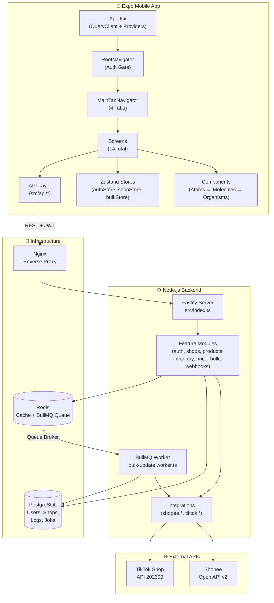
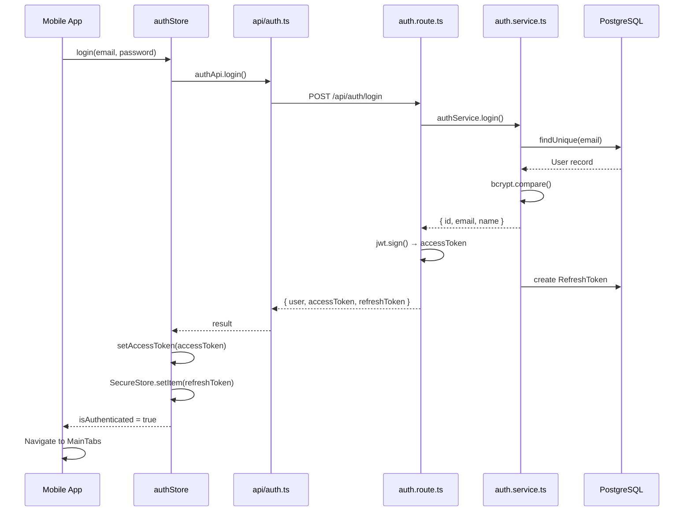
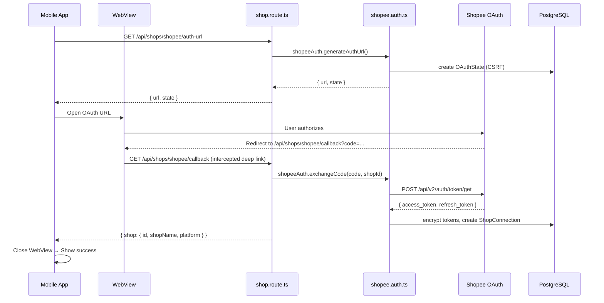
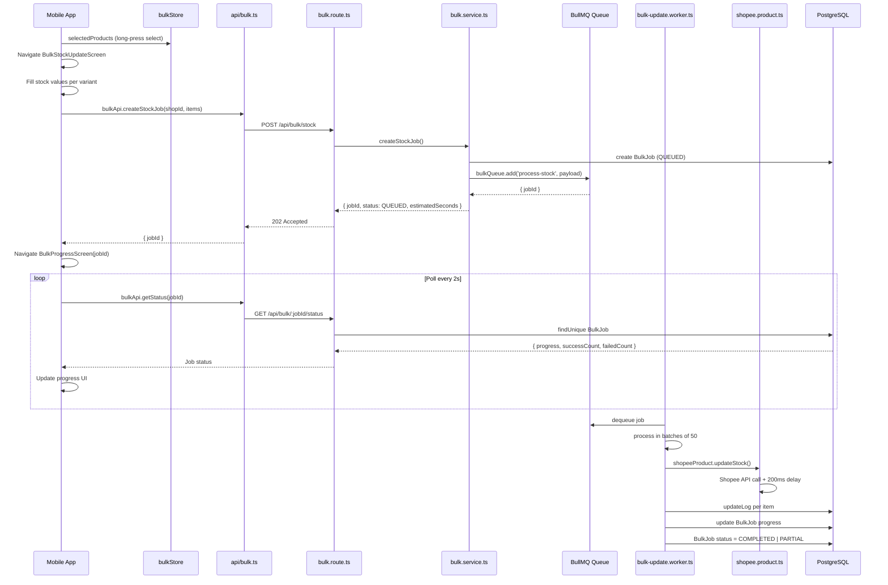
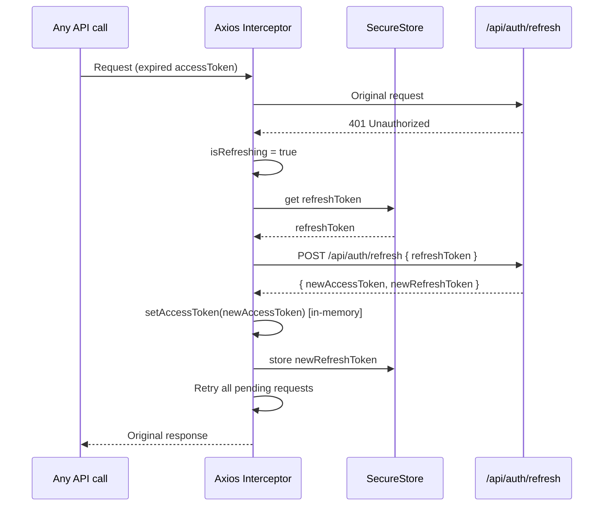
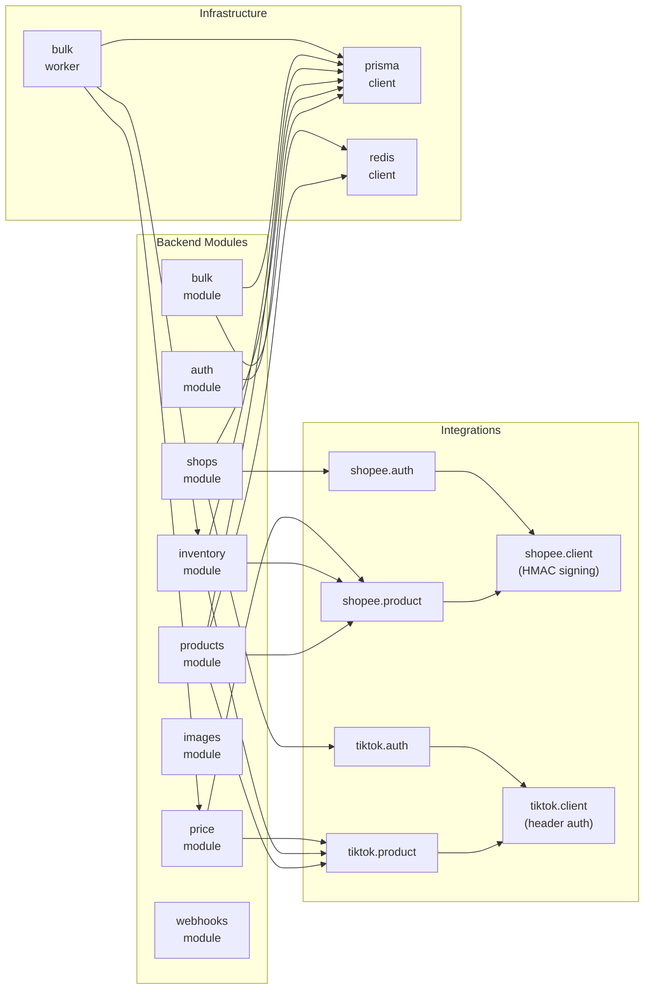
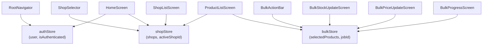
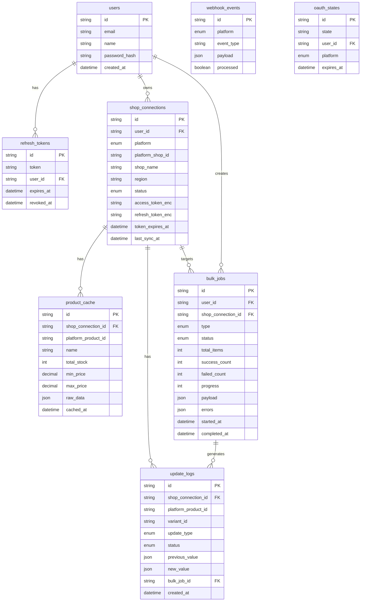

# PROJECT_MAP.md — LookUp Full Project Map

> Read `docs/AGENT.md` first. This file is the navigation guide for AI agents and developers. It contains the complete file tree, inter-file relationships, data flows, and architecture graphs.

---

## Complete File Tree

```
lookup/
├── docs/
│   ├── AGENT.md                      ← Rules, conventions (READ FIRST)
│   ├── ROADMAP.md                    ← Development phases & milestones
│   ├── API.md                        ← All endpoint contracts
│   ├── SCHEMA.md                     ← Database schema (Prisma + Redis)
│   ├── UI_DESIGN.md                  ← Screen & component specifications
│   └── PROJECT_MAP.md                ← This file
│
├── apps/
│   ├── mobile/                       ← Expo React Native app
│   │   ├── App.tsx                   ← Root: QueryClient + GestureHandler + SafeArea
│   │   ├── app.json                  ← Expo config
│   │   ├── package.json
│   │   ├── tsconfig.json
│   │   └── src/
│   │       ├── api/
│   │       │   ├── client.ts         ← Axios instance, JWT interceptor, auto-refresh
│   │       │   ├── auth.ts           ← /api/auth/* calls
│   │       │   ├── shops.ts          ← /api/shops/* calls
│   │       │   └── index.ts          ← products, inventory, price, bulk APIs
│   │       │
│   │       ├── stores/
│   │       │   ├── authStore.ts      ← User session, isAuthenticated
│   │       │   ├── shopStore.ts      ← Connected shops, active shop
│   │       │   └── bulkStore.ts      ← Multi-select state, bulk job items
│   │       │
│   │       ├── navigation/
│   │       │   ├── RootNavigator.tsx ← Auth gate, main + modal stacks
│   │       │   └── MainTabNavigator.tsx ← 4 bottom tabs
│   │       │
│   │       ├── screens/
│   │       │   ├── LoginScreen.tsx           ← Phase 1
│   │       │   ├── RegisterScreen.tsx        ← Phase 1
│   │       │   ├── HomeScreen.tsx            ← Phase 7 (dashboard)
│   │       │   ├── ProductListScreen.tsx     ← Phase 2 (core list + select)
│   │       │   ├── ProductDetailScreen.tsx   ← Phase 2
│   │       │   ├── ShopListScreen.tsx        ← Phase 1
│   │       │   ├── ConnectShopScreen.tsx     ← Phase 1 (OAuth WebView)
│   │       │   ├── EditStockScreen.tsx       ← Phase 3
│   │       │   ├── EditPriceScreen.tsx       ← Phase 3
│   │       │   ├── EditImageScreen.tsx       ← Phase 5
│   │       │   ├── BulkStockUpdateScreen.tsx ← Phase 4
│   │       │   ├── BulkPriceUpdateScreen.tsx ← Phase 4
│   │       │   ├── ActivityScreen.tsx        ← Phase 7
│   │       │   └── BulkProgressScreen.tsx   ← Phase 4
│   │       │
│   │       ├── components/
│   │       │   ├── atoms/
│   │       │   │   ├── Button.tsx            ← Reusable button (6 variants)
│   │       │   │   ├── Badge.tsx             ← Status labels
│   │       │   │   ├── StockIndicator.tsx    ← Color-coded stock number
│   │       │   │   ├── PlatformTag.tsx       ← Shopee/TikTok label
│   │       │   │   ├── Skeleton.tsx          ← Animated shimmer loader
│   │       │   │   ├── Divider.tsx           ← Line separator
│   │       │   │   └── TextInput.tsx         ← Styled input with label
│   │       │   │
│   │       │   ├── molecules/
│   │       │   │   ├── ProductCard.tsx       ← List item (image + info + select)
│   │       │   │   ├── ShopTag.tsx           ← Shop name with platform color
│   │       │   │   ├── StockInput.tsx        ← Stepper input for stock
│   │       │   │   ├── PriceInput.tsx        ← Currency input with discount calc
│   │       │   │   ├── VariantRow.tsx        ← Table row for variant data
│   │       │   │   ├── SearchBar.tsx         ← Debounced search input
│   │       │   │   ├── EmptyState.tsx        ← No data placeholder
│   │       │   │   ├── ErrorState.tsx        ← Error with retry
│   │       │   │   ├── ProgressBar.tsx       ← Animated fill bar
│   │       │   │   └── JobStatusCard.tsx     ← Bulk job summary card
│   │       │   │
│   │       │   └── organisms/
│   │       │       ├── ProductList.tsx       ← FlashList + skeletons + states
│   │       │       ├── BulkActionBar.tsx     ← Floating action bar (animate in)
│   │       │       ├── ShopSelector.tsx      ← Horizontal shop chip scroll
│   │       │       ├── SummaryCard.tsx       ← Dashboard shop stats card
│   │       │       └── VariantTable.tsx      ← Scrollable variant table
│   │       │
│   │       ├── hooks/
│   │       │   ├── useShops.ts              ← React Query for shops list
│   │       │   ├── useProducts.ts           ← React Query for products + infinite
│   │       │   ├── useProductDetail.ts      ← React Query for single product
│   │       │   ├── useBulkJob.ts            ← Polling hook for job status
│   │       │   └── useRealtimeEvents.ts     ← SSE client hook
│   │       │
│   │       ├── types/
│   │       │   └── index.ts                 ← All TypeScript interfaces
│   │       │
│   │       ├── utils/
│   │       │   ├── format.ts                ← Currency, number formatters
│   │       │   └── platform.ts              ← Platform detection helpers
│   │       │
│   │       └── constants/
│   │           ├── colors.ts                ← Color palette
│   │           ├── queryKeys.ts             ← React Query key factory
│   │           └── index.ts                 ← Barrel export + API_URL
│   │
│   └── backend/                       ← Node.js + Fastify API
│       ├── Dockerfile
│       ├── package.json
│       ├── tsconfig.json
│       ├── prisma/
│       │   └── schema.prisma              ← All DB models (see SCHEMA.md)
│       └── src/
│           ├── index.ts                   ← Server bootstrap, graceful shutdown
│           │
│           ├── modules/                   ← Feature modules (route + service + schema)
│           │   ├── auth/
│           │   │   ├── auth.route.ts      ← POST /api/auth/*
│           │   │   ├── auth.service.ts    ← register, login, token management
│           │   │   └── auth.schema.ts     ← Zod validation schemas
│           │   ├── shops/
│           │   │   ├── shop.route.ts      ← GET/DELETE /api/shops, OAuth URLs
│           │   │   └── shop.service.ts    ← listShops, getAuthUrl, disconnect
│           │   ├── products/
│           │   │   ├── product.route.ts   ← GET /api/products, /sync
│           │   │   └── product.service.ts ← listProducts, getDetail, syncProducts
│           │   ├── inventory/
│           │   │   ├── inventory.route.ts ← PATCH /api/inventory/:id
│           │   │   └── inventory.service.ts ← updateStock (routes to integration)
│           │   ├── price/
│           │   │   ├── price.route.ts     ← PATCH /api/price/:id
│           │   │   └── price.service.ts   ← updatePrice (routes to integration)
│           │   ├── images/
│           │   │   └── image.route.ts     ← POST /api/images/upload
│           │   ├── bulk/
│           │   │   ├── bulk.route.ts      ← POST /api/bulk/*, GET status/history
│           │   │   └── bulk.service.ts    ← createJob, getStatus, getHistory
│           │   ├── webhooks/
│           │   │   └── webhook.route.ts   ← POST /webhooks/*, GET /api/events/stream
│           │   └── index.ts               ← registerRoutes() — wires all modules
│           │
│           ├── integrations/              ← External API clients ONLY
│           │   ├── shopee/
│           │   │   ├── shopee.client.ts   ← Axios + HMAC-SHA256 signing
│           │   │   ├── shopee.auth.ts     ← OAuth URL gen, code exchange, refresh
│           │   │   └── shopee.product.ts  ← updateStock, updatePrice
│           │   └── tiktok/
│           │       ├── tiktok.client.ts   ← Axios + access-token header
│           │       ├── tiktok.auth.ts     ← OAuth URL gen, code exchange
│           │       └── tiktok.product.ts  ← updateInventory, updatePrice
│           │
│           ├── database/
│           │   └── client.ts              ← Prisma singleton
│           │
│           ├── cache/
│           │   └── redis.ts               ← IORedis client, getCache/setCache helpers
│           │
│           ├── queues/
│           │   └── bulk-update.worker.ts  ← BullMQ worker (batch processing)
│           │
│           ├── middleware/                ← (to implement: rate limit, error handler)
│           └── utils/
│               ├── env.ts                 ← Zod env validation
│               ├── logger.ts              ← Pino logger
│               └── crypto.ts             ← AES-256-GCM encrypt/decrypt
│
└── docker/
    ├── docker-compose.yml               ← Dev: postgres + redis + backend + nginx
    └── nginx/
        └── nginx.conf                   ← Reverse proxy config
```

---

## Architecture Overview



---

## Request Data Flow

### 1. Login Flow



---

### 2. Shopee OAuth Flow



---

### 3. Bulk Stock Update Flow



---

### 4. Token Auto-Refresh Flow



---

## Module Dependency Graph



---

## Mobile Store → Screen Dependency



---

## Database Table Relationships



---

## File Ownership by Phase

| Phase | Files to Create/Modify |
|-------|----------------------|
| 0 | `index.ts`, `utils/env.ts`, `utils/logger.ts`, `database/client.ts`, `cache/redis.ts`, `docker-compose.yml`, `App.tsx`, `api/client.ts` |
| 1 | `modules/auth/*`, `modules/shops/*`, `integrations/shopee/shopee.auth.ts`, `integrations/tiktok/tiktok.auth.ts`, `screens/LoginScreen.tsx`, `screens/RegisterScreen.tsx`, `screens/ShopListScreen.tsx`, `screens/ConnectShopScreen.tsx`, `stores/authStore.ts`, `stores/shopStore.ts` |
| 2 | `modules/products/*`, `integrations/shopee/shopee.product.ts`, `integrations/tiktok/tiktok.product.ts`, `screens/ProductListScreen.tsx`, `screens/ProductDetailScreen.tsx`, `components/molecules/ProductCard.tsx`, `components/organisms/ShopSelector.tsx`, `hooks/useProducts.ts` |
| 3 | `modules/inventory/*`, `modules/price/*`, `screens/EditStockScreen.tsx`, `screens/EditPriceScreen.tsx`, `components/molecules/StockInput.tsx`, `components/molecules/PriceInput.tsx` |
| 4 | `modules/bulk/*`, `queues/bulk-update.worker.ts`, `screens/BulkStockUpdateScreen.tsx`, `screens/BulkPriceUpdateScreen.tsx`, `screens/BulkProgressScreen.tsx`, `components/organisms/BulkActionBar.tsx`, `stores/bulkStore.ts`, `hooks/useBulkJob.ts` |
| 5 | `modules/images/*`, `integrations/shopee/shopee.images.ts`, `integrations/tiktok/tiktok.images.ts`, `screens/EditImageScreen.tsx` |
| 6 | `modules/webhooks/webhook.route.ts` (full impl), `hooks/useRealtimeEvents.ts` |
| 7 | `screens/HomeScreen.tsx`, `screens/ActivityScreen.tsx`, `components/organisms/SummaryCard.tsx` |
| 8 | `middleware/errorHandler.ts`, `middleware/rateLimiter.ts`, all tests `*.test.ts` |

---

## Key Implementation Notes for Agents

### When adding a new API endpoint:
1. Add route in the correct `modules/<name>/<name>.route.ts`
2. Add business logic in `modules/<name>/<name>.service.ts`
3. Add Zod schema in `modules/<name>/<name>.schema.ts`
4. If it calls Shopee/TikTok, add function in `integrations/`
5. Update `docs/API.md` with the new endpoint contract
6. Add corresponding API function in `apps/mobile/src/api/`

### When adding a new screen:
1. Create `apps/mobile/src/screens/<ScreenName>Screen.tsx`
2. Register in `RootNavigator.tsx` or `MainTabNavigator.tsx`
3. Add to `RootStackParamList` or `MainTabParamList` in `types/index.ts`
4. Update `docs/PROJECT_MAP.md` file tree
5. Reference `docs/UI_DESIGN.md` for the exact spec

### When adding a new store:
1. Create `apps/mobile/src/stores/<domain>Store.ts`
2. Follow Zustand pattern: `create<State>((set, get) => ({...}))`
3. Store only UI state — server state goes in React Query
4. Document in `docs/AGENT.md` store table

---

*Last updated: 2026-06-29 | See AGENT.md for update conventions.*
